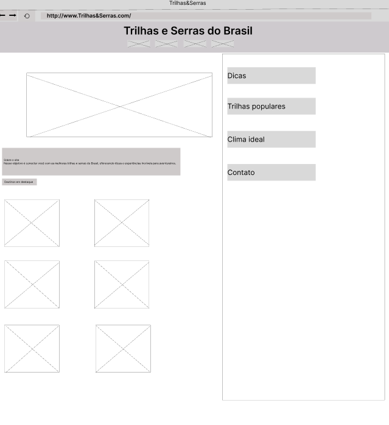
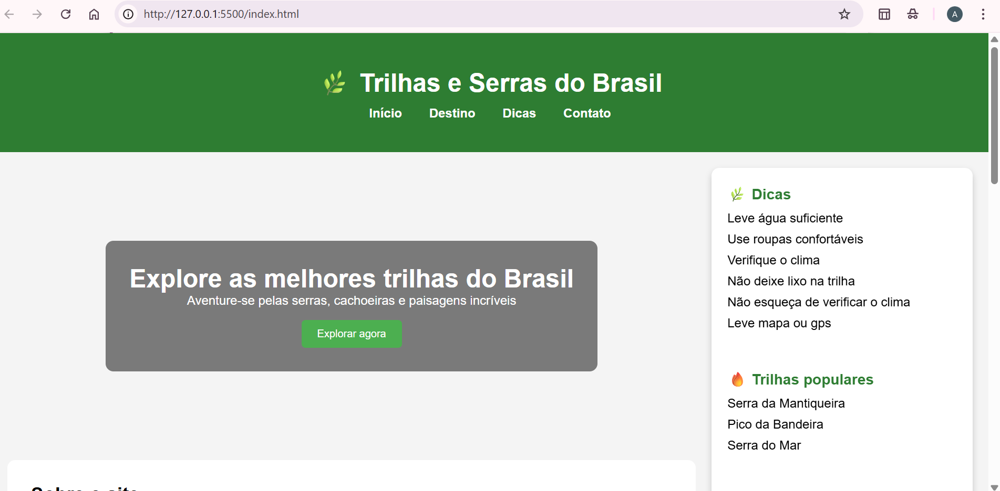

Nome: Ana Ayla Pires Reis 

Matrícula: 919036
Proposta: Irei criar um site a qual terá diversas informações de vários lugares para conhecer e divertir. Terá sobre várias Serras, trilhas e futuramente espero colocar um local para conseguir agendar uma pousada perto do local desejado.
Descrição: No sidebar tem informações básicas de como se preparar para as trilhas, dicas, melhor clima. Tem uma parte que irei selecionar trilhas mais difíceis/perigosas e as mais tranquilas. Coloquei em destaque serras mais conhecidas e visitadas com uma breve descrisão do local. 
Wireframe:

